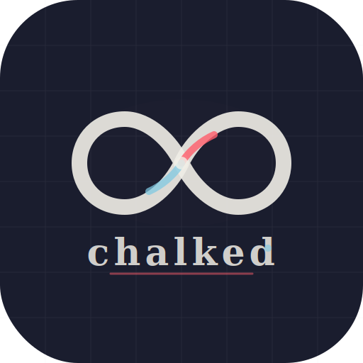

# Chalked

A native macOS desktop app for [Excalidraw](https://excalidraw.com/) — multi-tab drawing, local file management, and bundled shape libraries, all in a lightweight ~80MB footprint.



> [GitHub](https://github.com/aashishkr/chalked) · [Report an issue](https://github.com/aashishkr/chalked/issues)

## Features

- **Multi-tab** — open multiple drawings simultaneously, switch between them instantly
- **Local save / open** — save and load `.excalidraw` files anywhere on disk
- **Dirty-state tracking** — tab title shows `•` when unsaved; prompted on close like Sublime Text
- **Inline tab rename** — double-click any tab title to rename
- **Session persistence** — reopens your last set of files on restart
- **Auto-save** — unsaved tabs are periodically saved to a temp location so nothing is lost
- **Open in Web** — copies the current drawing to excalidraw.com in one click
- **Bundled libraries** — 4 shape libraries pre-loaded in the Library panel on every launch:
  - Architecture Diagram Components (11 items)
  - Software Architecture (7 items)
  - Stick Figures (9 items)
  - Systems Design Components (6 items)
- **Error logging** — local log files written to app data dir for debugging
- **Lightweight** — built on Tauri v2 + WebKit; uses ~80MB RAM vs ~250MB for Electron

## Tech Stack

| Layer | Technology |
|---|---|
| Native shell | [Tauri v2](https://tauri.app/) (Rust) |
| Frontend | React 18 + TypeScript + Vite 5 |
| Drawing engine | [@excalidraw/excalidraw](https://github.com/excalidraw/excalidraw) 0.17 |
| File I/O | tauri-plugin-fs, tauri-plugin-dialog |
| External links | tauri-plugin-shell |

## Prerequisites

- macOS 12+
- [Node.js](https://nodejs.org/) 18+
- [Rust](https://rustup.rs/) (stable toolchain)

## Getting Started

```bash
# Install dependencies
npm install

# Start in development mode (hot-reload)
npm run tauri dev

# Build a distributable .app
npm run tauri build
```

On first `tauri dev` run, Vite will pre-bundle Excalidraw (~30s). Subsequent starts are fast.

## Project Structure

```
chalked/
├── src/                        # React frontend
│   ├── App.tsx                 # Tab bar, toolbar, session management, close handler
│   ├── DrawingTab.tsx          # Excalidraw wrapper per tab (memoised)
│   ├── logger.ts               # Buffered async log writer with rotation
│   ├── styles.css              # Tab bar, toolbar, modal styles
│   ├── excalidrawlib.d.ts      # Type declarations for .excalidrawlib imports
│   └── assets/libs/            # Bundled Excalidraw shape libraries
│       ├── architecture-diagram-components.excalidrawlib
│       ├── software-architecture.excalidrawlib
│       ├── stick-figures.excalidrawlib
│       └── systems-design-components.excalidrawlib
├── src-tauri/                  # Rust / Tauri backend
│   ├── src/
│   │   ├── lib.rs              # Tauri builder (plugins wired here)
│   │   └── main.rs
│   ├── capabilities/
│   │   └── default.json        # IPC permission allowlist
│   ├── icons/                  # App icons (all sizes, 8-bit PNG + .icns + .ico)
│   ├── Cargo.toml
│   └── tauri.conf.json         # App config (identifier, CSP, window settings)
├── index.html
├── vite.config.ts
├── package.json
└── tsconfig.json
```

## Keyboard Shortcuts

| Shortcut | Action |
|---|---|
| `⌘S` | Save current drawing |
| `⌘⇧S` | Save As |
| `⌘O` | Open file in current tab |
| `⌘⇧O` | Open file in new tab |
| Double-click tab | Rename tab |

## Log Files

Logs are written to:
```
~/Library/Application Support/com.chalked.app/logs/app-YYYY-MM-DD.log
```

Rotated at 5 MB. JSON-per-line format.

## License

MIT
